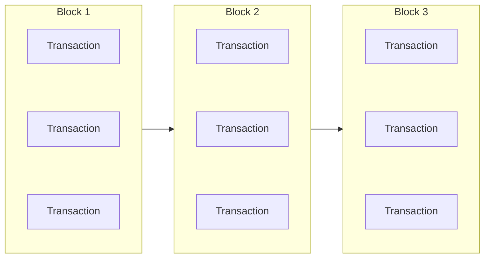

# TBPUB

## Bitcoin Core

### Description

Bitcoin core is the only fully trusted p2p network, such that when a transaction is created containing data its geuarenteed to proporgate across the network. The data type bitcoin core uses is a blockchain, which is a essentally a stack of blocks where the blocks contain a list of transactions. A new block is created and broadcast every ten minutes or so and can contain a couple thousand transactions.



### Transactions

Transactions are the only method of communication accross Bitcoin Core. All transactions have at least one input and one output.

```
{
    Inputs: [
        {
            txid: TXID, 
            vout: VOUT
        },
        .
        .
        .
    ],
    Outputs:[
        {
            "script/address": amount
        },
        .
        .
        .
    ]
}
```

### OP_RETURN
Any Output Script that starts with OP_RETURN(0xa9) is unspendable and concidered destroyed. This isnt harmful to Bitcoin because by destroying some Bitcoin, you make all the rest of it more rare and therefor more valuable. You can think of it as a donation to everyone that has bitcoin. 

### Limitations

Bitcoin Core requires a node to be online almost all the time to recieve new blocks.
Every transaction is transmited and stored on every node therefor we cannot store much data in the network.
Data sent through a Bitcoin Transaction is generally hundreds of times more expensive then data sent through tbPUB.


## tbPUB Transaction

tbPUB uses a certian type of Bitcoin Transaction that is used to discover Root Nodes and Published Books. 
All tbPUB Transactions have one output that sends to a script constructed as follows:
1. (RED)    OP_RETURN(0xa9)
2. (GREEN)  The text "TBPUB" hex encoded
3. (BLUE)   A 0 to indicate a Root Node URI OR a 1 to indicate a Book Hash
4. (PURPLE) The URI or Book Hash as indicated above

### Examples

A Root Node listing pointing to http://example.com


A Book Hash listing with the hash:
323072616E646F6D323063686172616374657273


The amount of BTC that was sent to the script starting with OP_RETURN is the Cost of the Transaction. If the transaction is publishing a Root Node URI that cost must be at least 10,000 sats to be valid. If the transaction is publishing a Book Hash the cost must be at least 1 sat per byte in the book. Any transactions that don't meet this requirement are ignored as invalid.

### Limitations
As its creating an unspendable Transaction Output we have to be very limited in the amount of data we store and how many of these tbPUB Transaction we create. Therefore we limit the protocal to one tbPUB Transaction per Block. If two or more tbPUB Transacactions are found only the highest paying one is concidered valid and the rest are ignored. This provides a large incentive to batch up documents before publishing and ensure that there are no other tbPUb Transactions in he mempool before broadcasting.

## tbPUB Bitcoin Interface

The tbPUB Bitcoin Interface(TBI) uses RPC to communicate with a running Bitcoin Core instance for the purpose of discoving and creating tbPUB Transactions. 
It will crawl through the blockchain looking for tbPUB Transactions and returing the data it finds, as well as listeing for transactions in future blocks.
The TBI also has its own RPC commands to allow you to publish a Root Node URI or Book Hash

### Datatypes

#### Page

An object that contains only a price and a data field. The price of the Page is equivilent to 1 Satoshi per Byte in the data field.

```JSON
{
    "price": 10,
    "data": "1234567890"
}
```

#### Book

A JSON Array of Pages. The price of the book is the sum of the prices of its pages.

```JSON
[
    {
        "price": 10,
        "data": "1234567890"
    },
    {
        "price": 20,
        "data": "12345678901112131415"
    },
    .
    .
    .
]

```

### RPC

#### broadcasturi __URI__ __price__ 
__URI__ (Required) The __URI__ pointing to a tbPUB Root Node

__price__ (Optional) The amount of BTC that will be destroyed to publish the __URI__, the minimum and default cost is 10,000 Satoshis

#### broadcastbook __book__ __price__
__book__ (Required) A JSON Array of tbPUB Pages

__price__ (Optinal) The amount of BTC that will be destroyed to publish the __book__, the minimum and deafult cost is 1 Satoshi Per byte in the data fields of the __book__

### Running the TBI

With a running Bitcoin Core instance and after downloading the binary run the following command replacing the options as needed:

```
/path/to/tbpub --rpcuser=rpcuser --rpcpassword=rpcpassword --wallet=WalletName 
```

#### datadir
The path to store all needed data for tbPUB, defaults to ~/.tbpub

#### rpcurl 
The url for the Bitcoin Core RPC, defaults to localhost:9443

#### rpcuser
The username for the Bitcoin Core RPC.

#### rpcpassword
The password for the Bitcoin Core RPC.

#### wallet
The name of the wallet to use for transaction creation.
