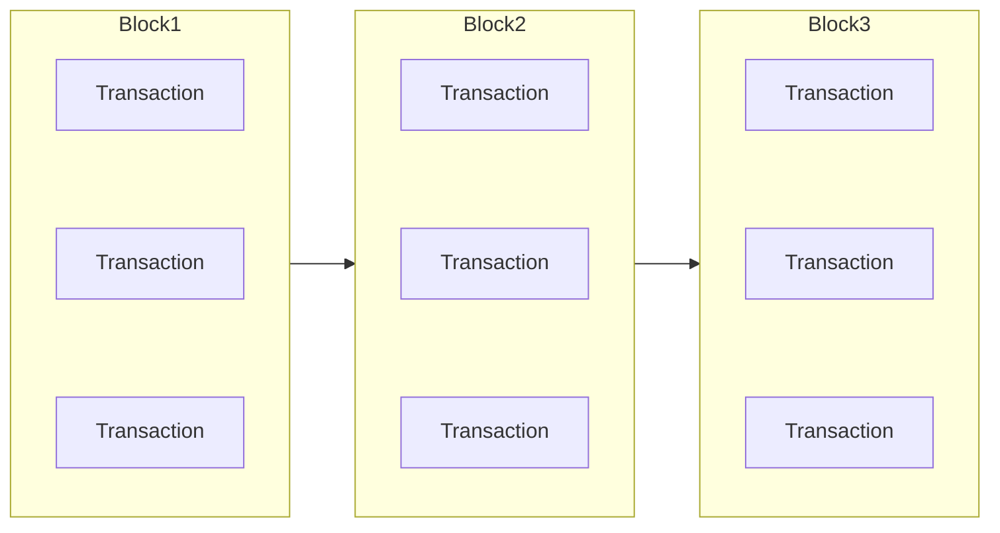
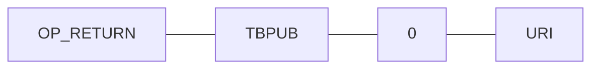

# TBPUB

## REQUISITS

## Bitcoin Core

### Description

Bitcoin core is the only fully trusted p2p network, such that when a transaction is created containing data its geuarenteed to proporgate across the network. The data type bitcoin core uses is a blockchain, which is a essentally a stack of blocks where the blocks contain a list of transactions. A new block is created and broadcast every ten minutes or so and can contain a couple thousand transactions.



### Transactions

Transactions are the only method of communication accross Bitcoin Core. All transactions have at least one input and one output.

```
{
    Inputs: [
        {
            txid: TXID, 
            vout: VOUT
        },
        .
        .
        .
    ],
    Outputs:[
        {
            "script/address": amount
        },
        .
        .
        .
    ]
}
```

### OP_RETURN
Any Output Script that starts with OP_RETURN(0xa9) is unspendable and concidered destroyed. This isnt harmful to Bitcoin because by destroying some Bitcoin, you make all the rest of it more rare and therefor more valuable. You can think of it as a donation to everyone that has bitcoin. 

### Limitations

Bitcoin Core requires a node to be online almost all the time to recieve new blocks.
Every transaction is transmited and stored on every node therefor we cannot store much data in the network.
Data sent through a Bitcoin Transaction is generally hundreds of times more expensive then data sent through tbPUB.


## tbPUB Transaction

tbPUB uses a certian type of Bitcoin Transaction that is used to discover Root Nodes and Published Books. 
All tbPUB Transactions have one output that sends to a script constructed as follows:
1. (RED)    OP_RETURN(0xa9)
2. (GREEN)  The text "TBPUB"
3. (BLUE)   A 0 to indicate a Root Node URI OR a 1 to indicate a Book Hash
4. (PURPLE) The URI or Book Hash as indicated above

A Root Node listing pointing to http://example.com


A Book Hash listing with the hash





## tbPUB Block Explorer

### Description

The tbPUB Block Explorer is the interface between tbPUB and the Bitcoin Network. It crawls through the blockchain looking for tbPUB Transactions and returing the data it finds.


## tbPUB Root Node

### Description 

The tbPUB Root Node is equivelent to the Bitcoin Core Full Node. It handles everything from discovery of dids and books, to verfication and storage of them.

### Block Chain Explorer
